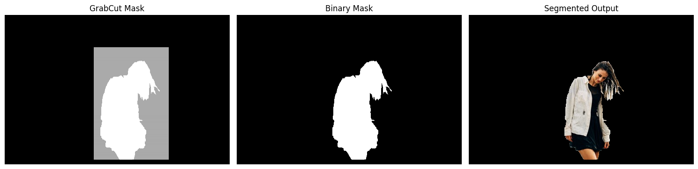

# GrabCut Foreground Segmentation using OpenCV

## Overview

This project demonstrates foreground extraction using OpenCV's GrabCut algorithm.

GrabCut is an interactive image segmentation technique that separates foreground objects from the background using graph-based optimization.

---

## Features

- Foreground extraction using GrabCut
- ROI-based initialization
- Automatic foreground/background estimation
- Binary mask generation
- Segmented object visualization

---

## Technologies Used

- Python
- OpenCV
- NumPy
- Matplotlib

---

## How GrabCut Works

1. User provides a rectangle around the object.
2. Pixels outside the rectangle are treated as background.
3. Pixels inside the rectangle are treated as unknown.
4. GrabCut models foreground and background distributions.
5. Graph-cut optimization separates object from background.
6. Final foreground mask is generated.

---

## Project Structure

```text
Grabcut_segmentation/
│
├── main.py
├── woman.jpeg
├── grabcut_results.png
├── README.md
```

---

## Installation

```bash
pip install opencv-python numpy matplotlib
```

---

## Run

```bash
python main.py
```

---

## Output

### Input Image
Image with user-defined ROI rectangle.

### GrabCut Mask
Shows pixel classifications:
- Definite Background
- Probable Background
- Probable Foreground
- Definite Foreground

### Binary Mask
Foreground pixels only.

### Segmented Image
Final extracted object.


---

## Applications

- Background Removal
- Photo Editing
- Object Extraction
- Medical Image Segmentation
- Dataset Annotation

---

## Notes

- ROI should fully contain the object.
- More iterations generally improve segmentation quality.
- GrabCut performs best when foreground and background differ visually.
