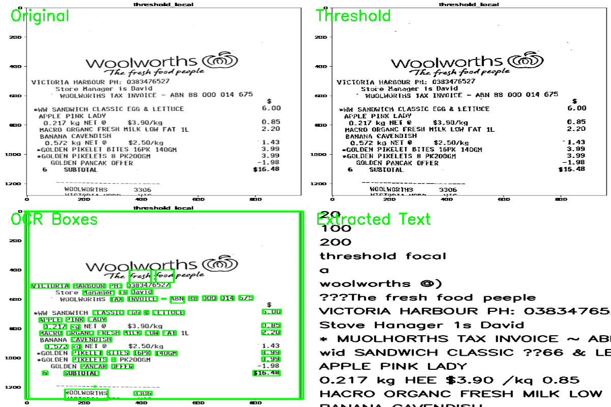
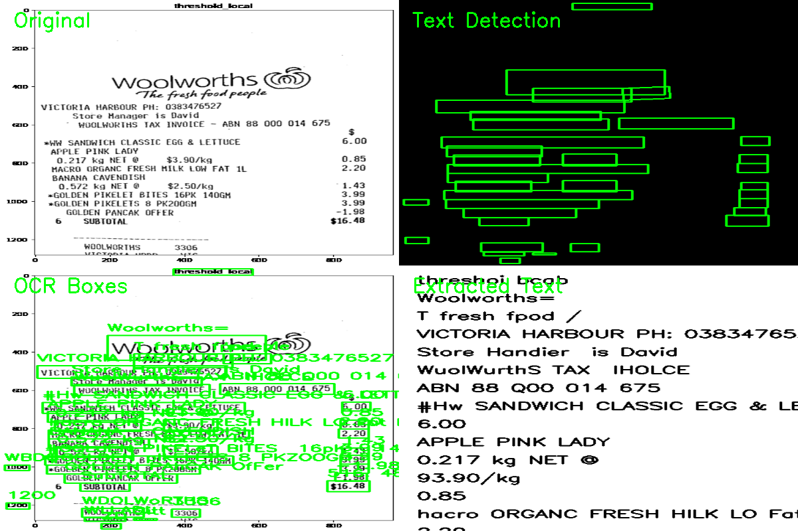

# OCR using PyTesseract and EasyOCR

## Overview

This project demonstrates Optical Character Recognition (OCR) using two popular OCR engines:

- PyTesseract
- EasyOCR

The project compares traditional OCR and deep-learning-based OCR on the same input image.

---

## Features

- Text Detection
- Text Recognition
- Bounding Box Visualization
- Confidence-Based Filtering
- Adaptive Thresholding
- OCR Comparison

---

## Technologies Used

- Python
- OpenCV
- PyTesseract
- EasyOCR
- NumPy
- Scikit-Image

---

## Project Structure

```text
OCR/
│
├── images/
│   └── test.png
│
├── output/
│   ├── pytesseract_summary.png
│   ├── easyocr_summary.png
│   ├── pytesseract_text.txt
│   └── easyocr_text.txt
│
├── pytesseract_demo.py
├── easy_ocr_demo.py
└── README.md
```

---

## Installation

```bash
pip install opencv-python
pip install pytesseract
pip install easyocr
pip install scikit-image
```

---

## Run

### PyTesseract

```bash
python pytesseract_demo.py
```

### EasyOCR

```bash
python easy_ocr_demo.py
```

---

## Results

### PyTesseract



### EasyOCR



---

## PyTesseract vs EasyOCR

| Feature | PyTesseract | EasyOCR |
|----------|------------|----------|
| OCR Type | Traditional | Deep Learning |
| Speed | Faster | Slower |
| Clean Documents | Excellent | Good |
| Natural Images | Moderate | Excellent |
| Preprocessing Required | Usually | Rarely |
| License Plates | Moderate | Good |
| Street Signs | Moderate | Excellent |

---

## Applications

- Document Digitization
- Invoice Processing
- License Plate Recognition
- Traffic Sign Recognition
- Receipt Scanning
- Autonomous Driving

---

## Future Improvements

- Real-Time OCR
- Webcam OCR
- Multi-Language OCR
- License Plate Recognition
- OCR + Object Detection Pipeline

---
