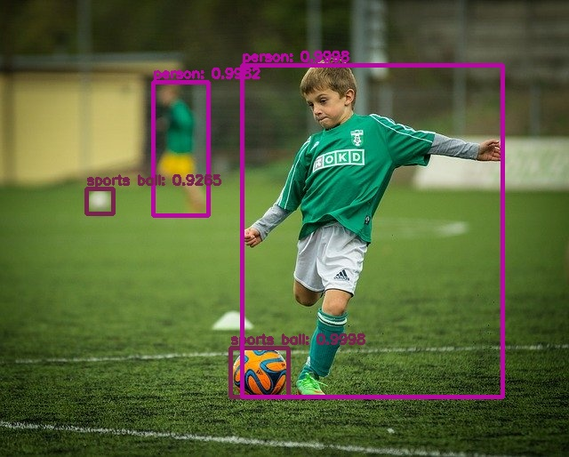

# YOLOv3 Object Detection using OpenCV

## Overview

This project demonstrates object detection using the YOLOv3 (You Only Look Once) deep learning model and OpenCV's DNN module.

YOLOv3 is a state-of-the-art real-time object detection algorithm capable of detecting multiple objects in a single image while maintaining high accuracy and speed.

The project processes all images in a folder, detects objects, draws bounding boxes with class labels and confidence scores, and saves the results automatically.

---

## Sample Result



---

## Features

- Object detection using YOLOv3
- Detection of 80 COCO object classes
- Automatic model loading
- Bounding box visualization
- Confidence score display
- Non-Maximum Suppression (NMS)
- Batch image processing
- Automatic result saving

---

## Technologies Used

- Python
- OpenCV
- NumPy
- Matplotlib

---

## How YOLO Works

1. Input images are loaded from the `images` folder.
2. Images are converted into blobs and resized to **416 × 416**.
3. The blob is passed through the YOLOv3 network.
4. The network predicts object classes and bounding boxes.
5. Low-confidence detections are filtered out.
6. Non-Maximum Suppression (NMS) removes duplicate detections.
7. Bounding boxes and labels are drawn on the image.
8. Detection results are saved to the `output` folder.

---

## Project Structure

```text
YOLOv3/
│
├── images/
│   ├── test1.jpg
│   └── test2.jpg
│
├── output/
│   ├── detected_test1.jpg
│   └── detected_test2.jpg
│
├── coco.names
├── yolov3.cfg
├── yolov3.weights
├── main.py
└── README.md
```
---

## Installation
pip install opencv-python numpy matplotlib

---

## Run
python main.py

---

## Output

- Input Images

  Images are stored inside:  images/
  
- Detection Results

  Processed images are automatically saved inside:  output/

---

## Each output image contains:

- Bounding boxes
- Object class labels
- Confidence scores

---

## Applications
- Autonomous Driving
- Traffic Monitoring
- Video Surveillance
- Smart Cities
- Robotics
- Retail Analytics
- Security Systems

---

## Concepts Demonstrated

- Deep Learning Object Detection
- YOLOv3 Architecture
- OpenCV DNN Module
- Confidence Thresholding
- Bounding Box Regression
- Non-Maximum Suppression (NMS)
- Computer Vision Pipelines

---

## Notes

- YOLOv3 is trained on the COCO dataset containing 80 object classes.
- Higher confidence thresholds help reduce false detections.
- Non-Maximum Suppression removes overlapping bounding boxes.
- GPU acceleration can significantly improve inference speed.
- YOLOv8 can be used as a more modern alternative.

---
